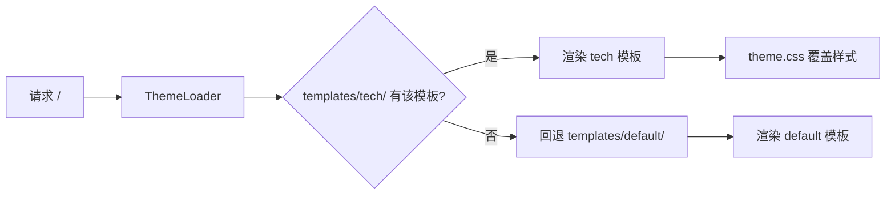

## 产品概述

在 `templates/` 下新建一个与 default 排版完全不同的极简主题（命名 `tech`），专为技术博客阅读优化，移动端优先。覆盖全部前台页面（首页/文章列表/文章详情/标签/关于/项目/友链/友链申请/状态/404/500），风格统一。同时删除 memories 功能（后台管理 + 前台 /nostalgia 全删，memories 数据表保留）。

## 核心功能

- 新主题 `tech`：极简单栏布局，无卡片网格/粒子/光晕/入场动画，参考 Hugo PaperMod / Hexo NexT / GitHub markdown 风格
- 移动端优先：单栏、安全区适配、触控目标 ≥44px、正文 ≥16px、汉堡抽屉导航、筛选折叠
- 全站宽度适配：唯一容器类全站共用，文章正文收窄至 720px 阅读宽度
- 文章列表：列表式条目（日期/标题/摘要/标签）+ 标签/年份筛选 + 客户端排序 + 分页
- 标签页：标签云按文章数降序
- 文章详情：md 排版（表格/任务列表/引用块）、代码高亮（highlight.js）、视频/iframe 16:9 容器、附件下载样式、TOC 目录、评论、上一篇/下一篇
- 深浅色模式：跟随系统 + localStorage 手动切换
- 删除 memories：后台 4 个路由 + 导航入口 + 2 个后台模板 + 前台 /nostalgia 路由与模板，数据表保留

## 技术栈

- Flask + Jinja2 服务端渲染（沿用现有架构，不引入前端框架）
- 原生 HTML/CSS/JS，无组件库、无构建工具
- 复用现有能力：markdown 渲染（`render_post_content()`）、highlight.js（`static/vendor/highlight.js/`）、上传接口（`/admin/upload/image|media|file`）、主题系统（`ThemeLoader` 自动识别 `templates/tech/`）

## 实现方式

利用现有主题系统：新建 `templates/tech/` 文件夹，后台「外观与主题」选择后立即生效。模板查找顺序 = `tech/` → `default/` → 根目录，新主题提供全部前台模板，完全覆盖 default。

关键决策：

1. **彻底独立于 default 样式**：新主题 `base.html` 不加载 `static/css/style.css`，只加载自己的 `theme.css`，从根上摆脱 default 的卡片网格/粒子/光晕/动画体系。
2. **全站唯一容器类**（`.tech-shell`，max-width 1000px + 左右 padding）：导航、主内容、页脚、所有页面共用，任何页面不得自定义 max-width，避免"卡片与 nav 不对齐、页面间位移"老 bug。文章正文阅读宽度用容器内子元素控制（`.post-body { max-width: 720px; margin: 0 auto }`）。
3. **移动端优先**：`viewport-fit=cover` + `env(safe-area-inset-*)` 安全区、正文 ≥16px 防 iOS 自动缩放、触控目标 ≥44px、移动端汉堡抽屉导航、列表页标签筛选折叠。
4. **深浅色模式**：沿用 default 的 `data-theme` + `localStorage('infowe-theme')` 机制（与后台一致），head 内联脚本防闪烁。
5. **文章详情展示层**：代码块 highlight.js 高亮（仅文章页加载，`defer` + `hljs.highlightAll()`）、视频/iframe 16:9 容器包裹、附件链接渲染为下载按钮样式、图片懒加载（后端已加）、表格/任务列表/引用块 GitHub 风格排版、TOC 目录（markdown toc 扩展已启用）。
6. **状态页硬约束**：必须使用官方类名 `svc-row` / `svc-dot` / `svc-name` / `svc-metrics` / `svc-metric`，并引用 `static/js/status.js`，否则轮询失效；模板中禁止调用 `lang_color()`（未注册 jinja global，调用会 500），fallback 用固定色 `#8b949e`。
7. **性能**：无粒子/光晕/入场动画（刷新位移与闪烁根因，禁止恢复）；CSS 单文件；highlight.js 仅文章页按需加载；无重型 JS。

## 架构设计

主题加载流程（现有机制，无需改动 app.py 主题部分）：



## 目录结构

```
templates/tech/                  [NEW] 新主题文件夹（后台自动识别）
├── info.json                    [NEW] 主题元数据 {name:"Tech", author, description, version}
├── theme.css                    [NEW] 全部样式（独立于 default，含深浅色变量、移动端适配）
├── theme.js                     [NEW] 移动端抽屉菜单、主题切换、回到顶部
├── base.html                    [NEW] 骨架：唯一容器 .tech-shell、极简导航、页脚、深浅色脚本
├── index.html                   [NEW] 首页：搜索框 + 列表式文章（日期/标题/摘要/标签）+ 分页
├── posts.html                   [NEW] 文章列表：标签/年份筛选 + 客户端排序 + 分页
├── post.html                    [NEW] 文章详情：md 排版、代码高亮、视频容器、附件样式、TOC、评论、上一篇/下一篇
├── tags.html                    [NEW] 标签云（按文章数降序）
├── about.html                   [NEW] 关于：简介 + 技能条 + 时间线
├── projects.html                [NEW] 项目列表
├── links.html                   [NEW] 友链列表
├── links_apply.html             [NEW] 友链申请表单
├── status.html                  [NEW] 状态页（官方类名 svc-* + static/js/status.js）
├── 404.html                     [NEW] 404 错误页
├── 500.html                     [NEW] 500 错误页
└── preview.png                  [NEW] 主题预览图（后台主题列表展示）

app.py                           [MODIFY] 删除 memories 相关代码
templates/admin/base.html        [MODIFY] 删除「时光记忆」导航项
templates/admin/memories.html    [DELETE] 删除文件
templates/admin/memory_edit.html [DELETE] 删除文件
templates/default/nostalgia.html [DELETE] 删除文件
```

## memories 删除明细（app.py）

- 删除 `db_load_memories()`（约 1988-1996 行）
- 删除 `/nostalgia` 路由（约 2240-2244 行）
- 删除 `admin_memories` / `admin_memory_new` / `admin_memory_edit` / `admin_memory_delete` / `_memory_from_form`（约 2856-2929 行）
- **保留** `memories` 建表语句（约 340-343 行），数据不迁移
- 删除 `templates/admin/base.html` 中「时光记忆」导航项（74-76 行）
- 删除 3 个模板文件；`backup/` 目录中的旧引用不动

## 实施注意

- 主题模板中 `` 会解析到 tech 自己的 base.html（主题目录优先），无需继承 default
- `icon()` 函数、`url_for('theme_static')`、`active_theme`、`theme_has_css` 等全局变量/函数可直接使用
- 新主题 base.html 需自行处理：favicon、OG/Twitter meta、RSS link、highlight.js 按需加载
- 后台 admin 模板不归属主题，不受影响
- 主题切换后需在后台「外观与主题」选择 tech 生效；`_theme_asset_ver()` 按 theme.css/theme.js mtime 自动刷新缓存

## 设计风格

极简主义 + 技术博客阅读优化，参考 Hugo PaperMod（单栏列表式文章）、Hexo NexT（简洁克制）、GitHub markdown 排版。彻底抛弃 default 的卡片网格/粒子/光晕/打字机动画。

- **布局**：全站单栏，唯一容器 `.tech-shell`（桌面 max-width 1000px，移动端 16px padding + safe-area）。文章详情正文收窄至 720px 阅读宽度。
- **导航**：顶部极简横条——左侧站点名，右侧文字链接（首页/文章/标签/项目/友链/关于/状态）；移动端折叠为汉堡抽屉（全屏遮罩 + 底部安全区）。
- **首页**：顶部搜索框 + 文章总数，下方列表式文章条目（日期 | 标题 | 摘要 | 标签），无卡片、无网格、无动画。
- **文章列表**：列表式条目 + 标签/年份筛选 chips（移动端折叠为"更多"按钮）+ 客户端排序。
- **文章详情**：标题 + 元信息（日期/分类/阅读时长/浏览数），正文 GitHub 风格 markdown 排版（标题锚点、表格、任务列表、引用块、代码块高亮），视频 16:9 容器，附件下载按钮，底部上一篇/下一篇 + 评论。
- **标签页**：标签云，标签名 + 文章数，hover 高亮。
- **交互**：hover 仅颜色/下划线变化，无位移无动画；回到顶部按钮；深浅色切换按钮。
- **响应式**：桌面 1000px 容器；≤768px 单栏 + 抽屉导航 + 筛选折叠；≤480px 字号/间距微调。

## Agent Extensions

### Skill

- **playwright-cli**
- Purpose: 启动本地 Flask 服务后，用浏览器自动化截图验证新主题在移动端（375px/390px 视口）与桌面的渲染效果，检查布局错位、溢出、导航抽屉、筛选折叠等
- Expected outcome: 输出移动端/桌面各核心页面截图，确认无横向滚动、无元素错位、深浅色模式正常，发现问题后迭代修复